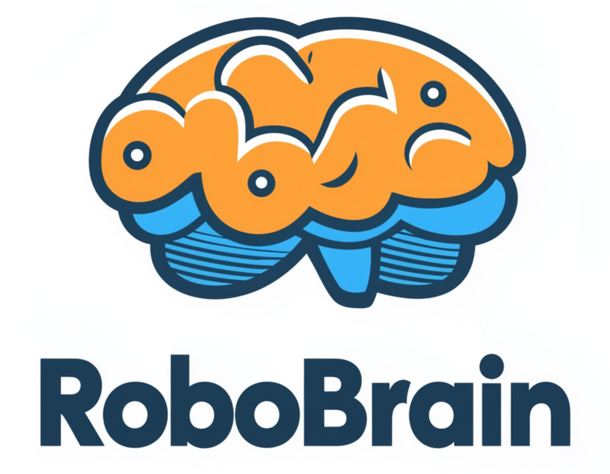
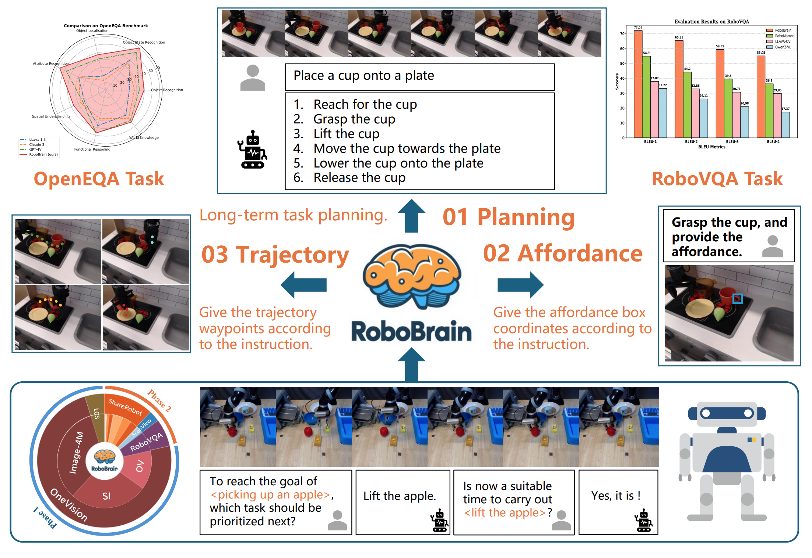
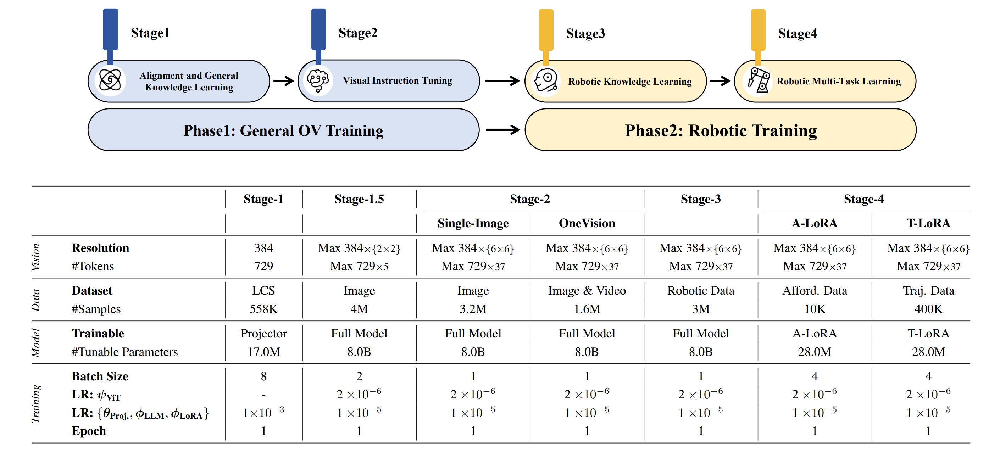
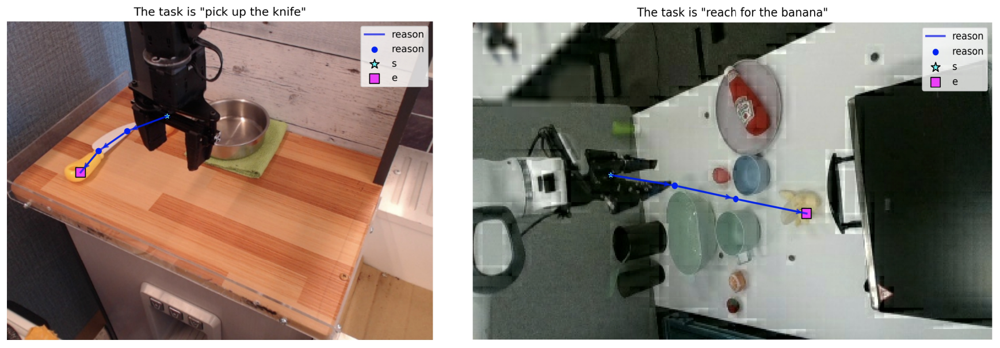
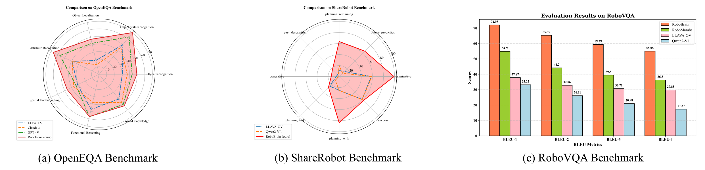

<div align="center">

</div>

# [CVPR 25] RoboBrain: A Unified Brain Model for Robotic Manipulation from Abstract to Concrete.


<p align="center">
        </a>&nbsp&nbsp⭐️ <a href="https://superrobobrain.github.io/">Project</a></a>&nbsp&nbsp | &nbsp&nbsp🤗 <a href="https://huggingface.co/BAAI/RoboBrain/">Hugging Face</a>&nbsp&nbsp | &nbsp&nbsp🤖 <a href="https://www.modelscope.cn/models/BAAI/RoboBrain/files/">ModelScope</a>&nbsp&nbsp | &nbsp&nbsp🌎 <a href="https://github.com/FlagOpen/ShareRobot">Dataset</a>&nbsp&nbsp | &nbsp&nbsp📑 <a href="http://arxiv.org/abs/2502.21257">Paper</a>&nbsp&nbsp | &nbsp&nbsp💬 <a href="./assets/wechat.png">WeChat</a>
</p>
<p align="center">
        </a>&nbsp&nbsp🔥🔥 <a href="https://github.com/FlagOpen/RoboBrain2.0"><strong>RoboBrain 2.0</strong></a><strong>: More powerful version of RoboBrain: See Better. Think Harder. Do Smarter.</strong>
</p>
<p align="center">
        </a>&nbsp&nbsp🎯 <a href="https://github.com/FlagOpen/RoboOS">RoboOS</a>: An Efficient Open-Source Multi-Robot Coordination System for RoboBrain.
</p>
<p align="center">
</a>&nbsp&nbsp🎯 <a href="https://github.com/tanhuajie/Reason-RFT">Reason-RFT</a>: Exploring Efficient RFT Paradigm to Enhance RoboBrain's Visual Reasoning Capabilities.
</p>

## 🔥 Overview
Recent advancements in Multimodal Large Language Models (MLLMs) have shown remarkable capabilities across various multimodal contexts. However, their application in robotic scenarios, particularly for long-horizon manipulation tasks, reveals significant limitations. These limitations arise from the current MLLMs lacking three essential robotic brain capabilities: **(1) Planning Capability**, which involves decomposing complex manipulation instructions into manageable sub-tasks; **(2) Affordance Perception**, the ability to recognize and interpret the affordances of interactive objects; and **(3) Trajectory Prediction**, the foresight to anticipate the complete manipulation trajectory necessary for successful execution. To enhance the robotic brain's core capabilities from abstract to concrete, we introduce ShareRobot, a high-quality heterogeneous dataset that labels multi-dimensional information such as task planning, object affordance, and end-effector trajectory. ShareRobot's diversity and accuracy have been meticulously refined by three human annotators. Building on this dataset, we developed RoboBrain, an MLLM-based model that combines robotic and general multi-modal data, utilizes a multi-stage training strategy, and incorporates long videos and high-resolution images to improve its robotic manipulation capabilities. Extensive experiments demonstrate that RoboBrain achieves state-of-the-art performance across various robotic tasks, highlighting its potential to advance robotic brain capabilities.

<div align="center">

</div>

## 🚀 Features
This repository supports:
- **`Data Preparation`**: Please refer to [Dataset Preparation](https://github.com/FlagOpen/ShareRobot) for how to prepare the dataset.
- **`Training for RoboBrain`**: Please refer to [Training Section](#Training) for the usage of training scripts.
- **`Support HF/VLLM Inference`**: Please see [Inference Section](#Inference), now we support inference with [VLLM](https://github.com/vllm-project/vllm).
- **`Evaluation for RoboBrain`**: Please refer to [Evaluation Section](#Evaluation) for how to prepare the benchmarks.
- **`ShareRobot Generation`**: Please refer to [ShareRobot](https://github.com/FlagOpen/ShareRobot) for details.


## 🗞️ News
- **`2025-06-06`**: 🤗 [RoboBrain 2.0-7B](https://huggingface.co/BAAI/RoboBrain2.0-7B) model checkpoint has been released in Huggingface..
- **`2025-06-06`**: 🔥 We're excited to announce the release of our more powerful [RoboBrain 2.0](https://github.com/FlagOpen/RoboBrain2.0).
- **`2025-04-11`**: 🎉 [RoboBrain](https://github.com/FlagOpen/RoboBrain/) was selected for CVPR 2025's official [Embodied AI Trends Commentary](https://cvpr.thecvf.com/Conferences/2025/News/AI_Enhanced_Robotics).
- **`2025-04-04`**: 🤗 We have released [Trajectory Checkpoint (T-LoRA)](https://huggingface.co/BAAI/RoboBrain-LoRA-Trajectory/) in Huggingface.
- **`2025-03-29`**: 🤗 We have released [Affordance Checkpoint (A-LoRA)](https://huggingface.co/BAAI/RoboBrain-LoRA-Affordance/) in Huggingface.
- **`2025-03-27`**: 🤗 We have released [Planning Checkpoint](https://huggingface.co/BAAI/RoboBrain/) in Huggingface.
- **`2025-03-26`**: 🔥 We have released the [RoboBrain](https://github.com/FlagOpen/RoboBrain/) repository.
- **`2025-02-27`**: 🌍 Our [RoboBrain](http://arxiv.org/abs/2502.21257/) was accepted to CVPR2025.


## 📆 Todo
- [x] Release scripts for model training and inference.
- [x] Release Planning checkpoint.
- [x] Release Affordance checkpoint.
- [x] Release ShareRobot dataset.
- [x] Release Trajectory checkpoint.
- [x] Release more powerful **Robobrain 2.0**.


## 🤗 Models

- **[`Base Planning Model`](https://huggingface.co/BAAI/RoboBrain/)**: The model was trained on general datasets in Stages 1–2 and on the Robotic Planning dataset in Stage 3, which is designed for Planning prediction.
- **[`A-LoRA for Affordance`](https://huggingface.co/BAAI/RoboBrain-LoRA-Affordance/)**: Based on the Base Planning Model, Stage 4 involves LoRA-based training with our Affordance dataset to predict affordance.
- **[`T-LoRA for Trajectory`](https://huggingface.co/BAAI/RoboBrain-LoRA-Trajectory/)**: Based on the Base Planning Model, Stage 4 involves LoRA-based training with our Trajectory dataset to predict trajectory.

<div align="center">

</div>

| Models               | Checkpoint                                                     | Description                                                | 
|----------------------|----------------------------------------------------------------|------------------------------------------------------------|
| Planning Model       | [🤗 Planning CKPTs](https://huggingface.co/BAAI/RoboBrain/)   | Used for Planning prediction in our paper                   | 
| Affordance (A-LoRA)  | [🤗 Affordance CKPTs](https://huggingface.co/BAAI/RoboBrain-LoRA-Affordance/)      | Used for Affordance prediction in our paper | 
| Trajectory (T-LoRA)  | [🤗 Trajectory CKPTs](https://huggingface.co/BAAI/RoboBrain-LoRA-Trajectory/)      | Used for Trajectory prediction in our paper | 
| RoboBrain 2.0 7B     | [🤗 BAAI/RoboBrain2.0-7B](https://huggingface.co/BAAI/RoboBrain2.0-7B)   | 7B parameter version of the RoboBrain2.0                   | 
| RoboBrain 2.0 32B    | [🤗 BAAI/RoboBrain2.0-32B](https://huggingface.co/BAAI/RoboBrain2.0-32B)   | 32B parameter version of the RoboBrain2.0 *(Coming soon)*

**Note: Please refer to [RoboBrain 2.0 Github](https://github.com/FlagOpen/RoboBrain2.0) for the usage of RoboBrain 2.0**

## 🛠️ Setup

```bash
# clone repo.
git clone https://github.com/FlagOpen/RoboBrain.git
cd RoboBrain

# build conda env.
conda create -n robobrain python=3.10
conda activate robobrain
pip install -r requirements.txt
```

## <a id="Training"> 🤖 Training</a>

### 1. Data Preparation

```bash
# Modify datasets for Stage 1, please refer to:
- yaml_path: scripts/train/yaml/stage_1_0.yaml

# Modify datasets for Stage 1.5, please refer to:
- yaml_path: scripts/train/yaml/stage_1_5.yaml

# Modify datasets for Stage 2_si, please refer to:
- yaml_path: scripts/train/yaml/stage_2_si.yaml

# Modify datasets for Stage 2_ov, please refer to:
- yaml_path: scripts/train/yaml/stage_2_ov.yaml

# Modify datasets for Stage 3_plan, please refer to:
- yaml_path: scripts/train/yaml/stage_3_planning.yaml

# Modify datasets for Stage 4_aff, please refer to:
- yaml_path: scripts/train/yaml/stage_4_affordance.yaml

# Modify datasets for Stage 4_traj, please refer to:
- yaml_path: scripts/train/yaml/stage_4_trajectory.yaml
```
**Note:** The sample format in each json file should be like:
```json
{
    "id": "xxxx",
    "image": [
        "image1.png",
        "image2.png",
    ],
    "conversations": [
        {
            "from": "human",
            "value": "<image>\n<image>\nAre there numerous dials near the bottom left of the tv?"
        },
        {
            "from": "gpt",
            "value": "Yes. The sun casts shadows ... a serene, clear sky."
        }
    ]
},
```

### 2. Training 
```bash
# Training on Stage 1:
bash scripts/train/stage_1_0_pretrain.sh

# Training on Stage 1.5:
bash scripts/train/stage_1_5_direct_finetune.sh

# Training on Stage 2_si:
bash scripts/train/stage_2_0_resume_finetune_si.sh

# Training on Stage 2_ov:
bash scripts/train/stage_2_0_resume_finetune_ov.sh

# Training on Stage 3_plan:
bash scripts/train/stage_3_0_resume_finetune_robo.sh

# Training on Stage 4_aff:
bash scripts/train/stage_4_0_resume_finetune_lora_a.sh

# Training on Stage 4_traj:
bash scripts/train/stage_4_0_resume_finetune_lora_t.sh
```
**Note:** Please change the environment variables (e.g. *DATA_PATH*, *IMAGE_FOLDER*, *PREV_STAGE_CHECKPOINT*) in the script to your own.

### 3. Convert original weights to HF weights
```bash
# Planning Model
python model/llava_utils/convert_robobrain_to_hf.py --model_dir /path/to/original/checkpoint/ --dump_path /path/to/output/

# A-LoRA & T-RoRA
python model/llava_utils/convert_lora_weights_to_hf.py --model_dir /path/to/original/checkpoint/ --dump_path /path/to/output/
```

### (Option) 4. Compress Model
Model compression by Flagscale, the model is compressed to W8A16, reducing the model size by more than 40%. The inference speed can be accelerated by up to 50%, but the generated results after compression may differ slightly from those before compression.
```bash
git clone https://github.com/FlagOpen/FlagScale.git
cd FlagScale

python run.py --config-path examples/llava_onevision/conf --config-name  config_compress

### compress model save in RoboBrain_Compressed directory
``` 

## <a id="Inference">⭐️ Inference</a>

### 1. Usage for Planning Prediction

#### Option 1: HF inference

```python
from inference import SimpleInference

model_id = "BAAI/RoboBrain"
model = SimpleInference(model_id)

prompt = "Given the obiects in the image, if you are required to complete the task \"Put the apple in the basket\", what is your detailed plan? Write your plan and explain it in detail, using the following format: Step_1: xxx\nStep_2: xxx\n ...\nStep_n: xxx\n"

image = "./assets/demo/planning.png"

pred = model.inference(prompt, image, do_sample=True)
print(f"Prediction: {pred}")

''' 
Prediction: (as an example)
    Step_1: Move to the apple. Move towards the apple on the table.
    Step_2: Pick up the apple. Grab the apple and lift it off the table.
    Step_3: Move towards the basket. Move the apple towards the basket without dropping it.
    Step_4: Put the apple in the basket. Place the apple inside the basket, ensuring it is in a stable position.
'''

```

#### Option 2: VLLM inference
Install and launch VLLM
```bash
# Install vllm package
pip install vllm==0.6.6.post1

# Launch Robobrain with vllm
python -m vllm.entrypoints.openai.api_server --model BAAI/RoboBrain --served-model-name robobrain  --max_model_len 16384 --limit_mm_per_prompt image=8
```

Run python script as example:
```python
from openai import OpenAI
import base64

openai_api_key = "robobrain-123123" 
openai_api_base = "http://127.0.0.1:8000/v1"

client = OpenAI(
    api_key=openai_api_key,
    base_url=openai_api_base,
)

prompt = "Given the obiects in the image, if you are required to complete the task \"Put the apple in the basket\", what is your detailed plan? Write your plan and explain it in detail, using the following format: Step_1: xxx\nStep_2: xxx\n ...\nStep_n: xxx\n"

image = "./assets/demo/planning.png"

with open(image, "rb") as f:
    encoded_image = base64.b64encode(f.read())
    encoded_image = encoded_image.decode("utf-8")
    base64_img = f"data:image;base64,{encoded_image}"

response = client.chat.completions.create(
    model="robobrain",
    messages=[
        {
            "role": "user",
            "content": [
                {"type": "image_url", "image_url": {"url": base64_img}},
                {"type": "text", "text": prompt},
            ],
        },
    ]
)

content = response.choices[0].message.content
print(content)

'''
Prediction: (as an example)
    Step_1: Move to the apple. Move towards the apple on the table.
    Step_2: Pick up the apple. Grab the apple and lift it off the table.
    Step_3: Move towards the basket. Move the apple towards the basket without dropping it.
    Step_4: Put the apple in the basket. Place the apple inside the basket, ensuring it is in a stable position.
'''
```

#### Option 3: FlagScale Serve
[FlagScale](https://github.com/FlagOpen/FlagScale) is a comprehensive toolkit designed to support the entire lifecycle of large models, developed with the backing of the Beijing Academy of Artificial Intelligence (BAAI). FlagScale supports distributed deployment of large models, which can be launched easily through a simple configuration file.

**Set config file and install FlagScale**
```bash
git clone https://github.com/FlagOpen/FlagScale.git

cd FlagScale

# service config
vim examples/llava_onevision/conf/config_llava_onevision.yaml
# model config
vim examples/llava_onevision/conf/serve/serve_llava.yaml
# (multiple nodes deployment required)
vim examples/llava_onevision/conf/hostfile.txt

# install FlagScale
pip install .
```

For better integration with FlagScale, you can optionally install [vLLM inside FlagScale](https://github.com/FlagOpen/FlagScale?tab=readme-ov-file#setup).

**Launch service**
```bash
# launch service with default config file
flagscale serve llava_onevision
# or launch service with custom config file
flagscale serve llava_onevision <MODEL_CONFIG_YAML>
```
The Python script used to call the service remains the same as before.


### 2. Usage for Affordance Prediction
```python
from inference import SimpleInference

model_id = "BAAI/RoboBrain"
lora_id = "BAAI/RoboBrain-LoRA-Affordance"
model = SimpleInference(model_id, lora_id)

# Example 1:
prompt = "You are a robot using the joint control. The task is \"pick_up the suitcase\". Please predict a possible affordance area of the end effector?"

image = "./assets/demo/affordance_1.jpg"

pred = model.inference(prompt, image, do_sample=False)
print(f"Prediction: {pred}")

'''
    Prediction: [0.733, 0.158, 0.845, 0.263]
'''

# Example 2:
prompt = "You are a robot using the joint control. The task is \"push the bicycle\". Please predict a possible affordance area of the end effector?"

image = "./assets/demo/affordance_2.jpg"

pred = model.inference(prompt, image, do_sample=False)
print(f"Prediction: {pred}")

'''
    Prediction: [0.600, 0.127, 0.692, 0.227]
'''

```

<div align="center">

</div>

### 3. Usage for Trajectory Prediction
```python
from inference import SimpleInference

model_id = "BAAI/RoboBrain"
lora_id = "BAAI/RoboBrain-LoRA-Trajectory"
model = SimpleInference(model_id, lora_id)

# Example 1:
prompt = "You are a robot using the joint control. The task is \"pick up the knife\". Please predict up to 10 key trajectory points to complete the task. Your answer should be formatted as a list of tuples, i.e. [[x1, y1], [x2, y2], ...], where each tuple contains the x and y coordinates of a point."

image = "./assets/demo/trajectory_1.png"

pred = model.inference(prompt, image, do_sample=False)
print(f"Prediction: {pred}")

'''
    Prediction: [[0.375, 0.297], [0.281, 0.344], [0.214, 0.406], [0.172, 0.473]]
'''

# Example 2:
prompt = "You are a robot using the joint control. The task is \"reach for the banana\". Please predict up to 10 key trajectory points to complete the task. Your answer should be formatted as a list of tuples, i.e. [[x1, y1], [x2, y2], ...], where each tuple contains the x and y coordinates of a point."

image = "./assets/demo/trajectory_2.png"

pred = model.inference(prompt, image, do_sample=False)
print(f"Prediction: {pred}")

'''
    Prediction: [[0.264, 0.479], [0.387, 0.512], [0.505, 0.554], [0.642, 0.6]]
'''

```

<div align="center">

</div>


## <a id="Evaluation">🤖 Evaluation</a>

<div align="center">

</div>

## 😊 Acknowledgement  

We would like to express our sincere gratitude to the developers and contributors of the following projects:  
1. [LLaVA-NeXT](https://github.com/LLaVA-VL/LLaVA-NeXT): The comprehensive codebase for training Vision-Language Models (VLMs).  
2. [lmms-eval](https://github.com/EvolvingLMMs-Lab/lmms-eval): A powerful evaluation tool for Vision-Language Models (VLMs).
3. [vllm](https://github.com/vllm-project/vllm): A high-throughput and memory-efficient LLMs/VLMs inference engine.
4. [OpenEQA](https://github.com/facebookresearch/open-eqa): A wonderful benchmark for Embodied Question Answering.
5. [RoboVQA](https://github.com/google-deepmind/robovqa): Provide high-level reasoning models and datasets for robotics applications.

Their outstanding contributions have played a pivotal role in advancing our research and development initiatives.

## 📑 Citation
If you find this project useful, welcome to cite us.
```bib
@article{ji2025robobrain,
  title={RoboBrain: A Unified Brain Model for Robotic Manipulation from Abstract to Concrete},
  author={Ji, Yuheng and Tan, Huajie and Shi, Jiayu and Hao, Xiaoshuai and Zhang, Yuan and Zhang, Hengyuan and Wang, Pengwei and Zhao, Mengdi and Mu, Yao and An, Pengju and others},
  journal={arXiv preprint arXiv:2502.21257},
  year={2025}
}
```
